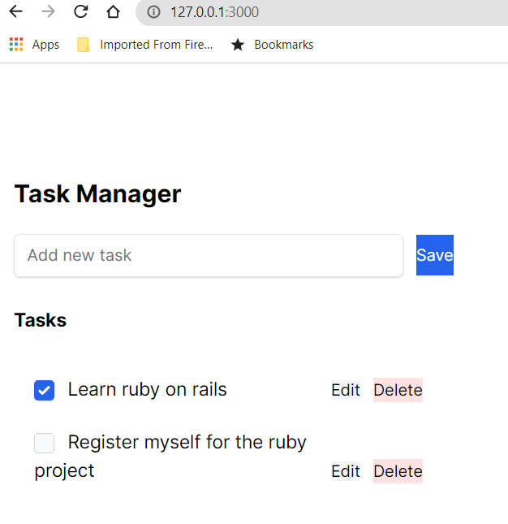

=======
# README

This README contains the steps which are necessary to get the application up and running.

* Ruby version: check my gem file

* System dependencies

* Configuration

* Database creation: I used the SQLtools extension in vscode then connected my db by selecting the 'development.sqlite3' file from my 'db' folder. I named my database as task_manager.

* Deployment instructions: use cmd( do not use git bash) and type 'rails s' to get my app up and running(ofcourse remove the quotations for the execute command)  
